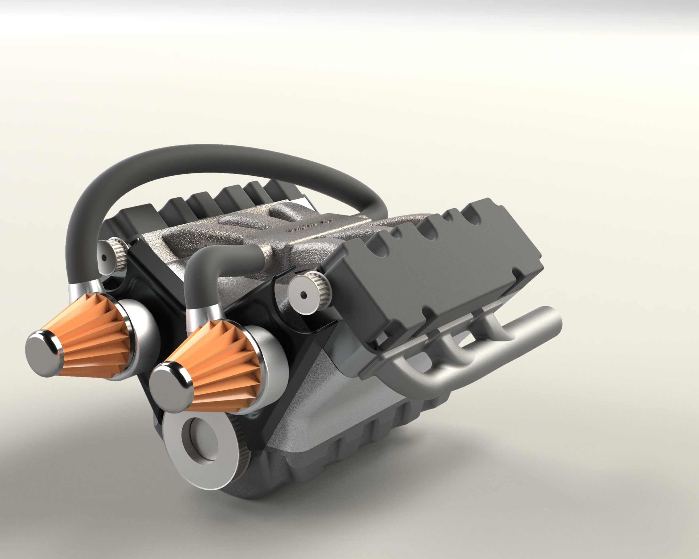
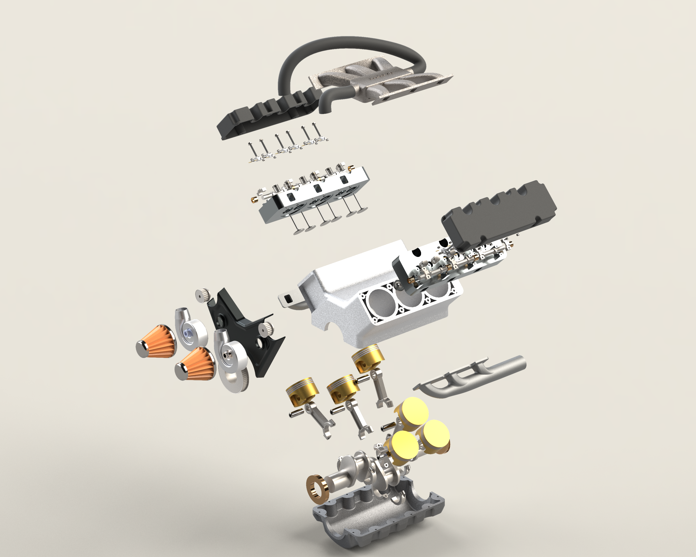

# Digital V6 Engine Replica

<p align="center">
  
</p>

<p align="center">
A SolidWorks-based digital replica of a V6 internal combustion engine featuring modular assemblies, engineering drawings, and high-quality renders created using SolidWorks Visualize.
</p>

<p align="center">


</p>

---

## About the Project

This project is a digital replica of a V6 internal combustion engine created in **SolidWorks**. The engine is organized using a modular assembly structure and includes individual part files, subassemblies, engineering drawings, and visualization assets created using **SolidWorks Visualize**.

The main goal of the project was to better understand engine architecture, assembly workflow, and mechanical design while building a complete CAD model from individual components.

---

## Gallery

<p align="center">
  
  
</p>

> More renders and SolidWorks screenshots are available in the **images** directory.

---

## Project Highlights

- Complete V6 engine assembly with approximately **190 individual components**
- Modular assembly and subassembly workflow
- Native SolidWorks part, assembly, and drawing files
- Engineering drawings provided in both **SLDDRW** and **PDF** formats
- High-quality renders created using **SolidWorks Visualize**
- Organized repository structure for easier navigation

---

## Repository Structure

```text
.
├── animations/
├── cad/
│   ├── assemblies/
│   ├── subassemblies/
│   ├── parts/
│   └── drawings/
└── images/
```

---

## Project Assets

| Folder | Description |
|---------|-------------|
| **cad/** | SolidWorks assemblies, subassemblies, parts, and engineering drawings |
| **images/** | SolidWorks Visualize renders and SolidWorks screenshots |
| **animations/** | SolidWorks Visualize project files used to create the renders |

---

## Software

| Software | Recommended Version |
|----------|--------------------:|
| SolidWorks | 2025 or later |
| SolidWorks Visualize | 2025 or later |

---

## Opening the Project

1. Open the main assembly:

```text
cad/assemblies/v6 engine.SLDASM
```

2. Allow SolidWorks to resolve all referenced files if prompted.

3. To recreate the rendered images, open the SolidWorks Visualize projects available in the **animations** directory.

---

## Documentation

Additional documentation for different parts of the project is available inside the repository.

- CAD files → `cad/`
- Engineering drawings → `cad/drawings/`
- Renders and screenshots → `images/`
- Visualize projects → `animations/`

---

## License

This project is licensed under the **MIT License**.

---

## Author

**Pratik Hadiya**

Mechanical Engineering Student  
Indian Institute of Technology Ropar

GitHub: https://github.com/pratikhadiya60